# XURA — XRP Wallet & Gaming Platform

> **Non-custodial XRP Ledger wallet with built-in blockchain-powered games.**  
> Android application written in Java · minSdk 28 (Android 9+) · version 26.7.7  
> *Originally started in 2022 as an XRP wallet experiment — rewritten and actively maintained through 2026.*

---

## ⚠️ Important Notice / Важное предупреждение

**GAME SERVER IS NOT YET LIVE.**  
The gaming logic (Roulette, Guess the Color, Guess the Number, Slot Machine) requires a dedicated backend server that is currently under development. **Do NOT play with real XRP until the server goes live.** The author will announce availability separately.

> **Игровой сервер ещё не запущен.**  
> Игровая логика (рулетка, «Угадай цвет», «Угадай число», слот-машина) требует бэкенд-сервера, который сейчас в разработке. **Не играйте на реальный XRP до официального объявления запуска.**

---

## Screenshots

<p align="center">
  
  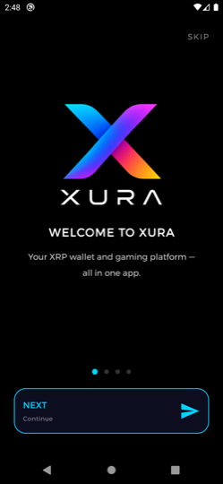
  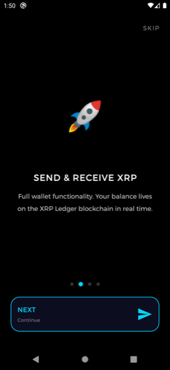
  
  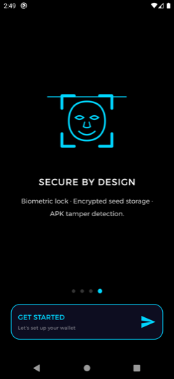
</p>

<p align="center">
  <em>Splash · Onboarding: Welcome · Send &amp; Receive · Play &amp; Win · Secure by Design</em>
</p>

<p align="center">
  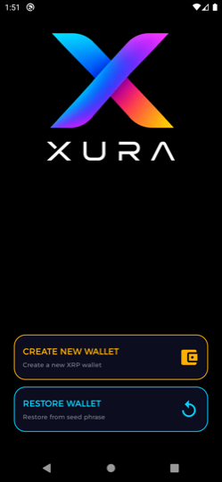
  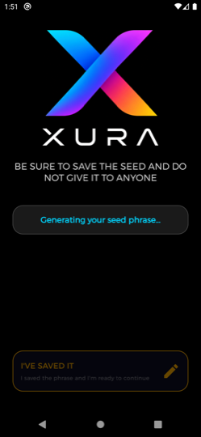
  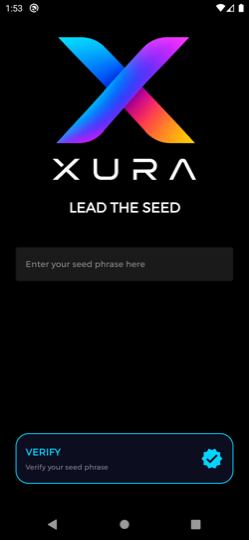
  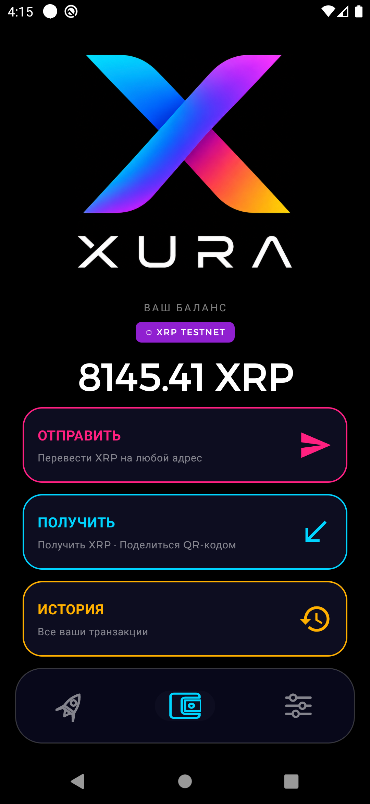
  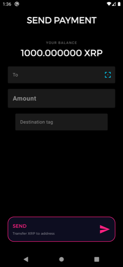
</p>

<p align="center">
  <em>Create or restore · New wallet seed · Seed verification · Main wallet · Send XRP</em>
</p>

<p align="center">
  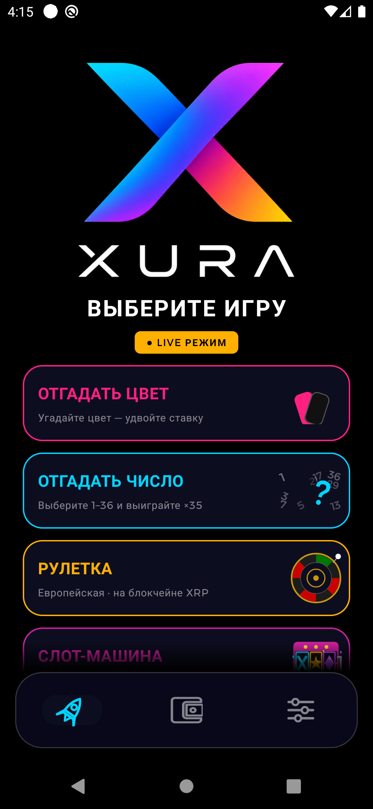
  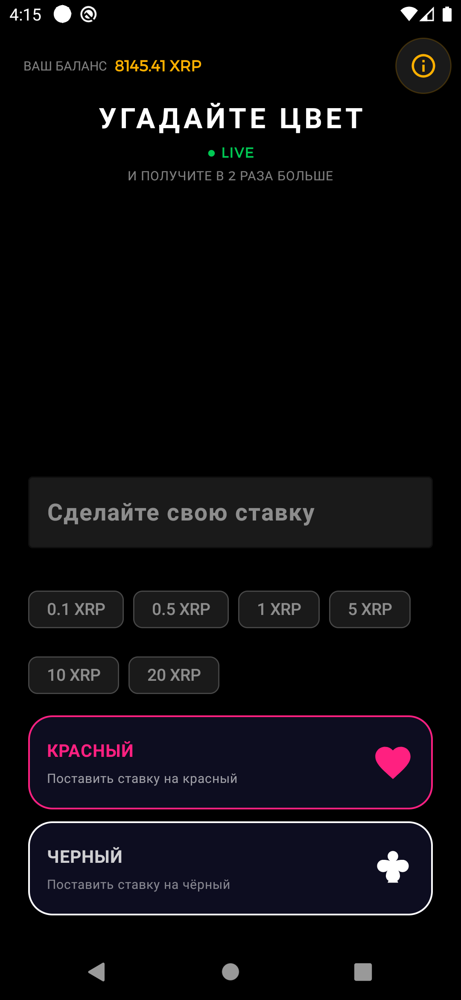
  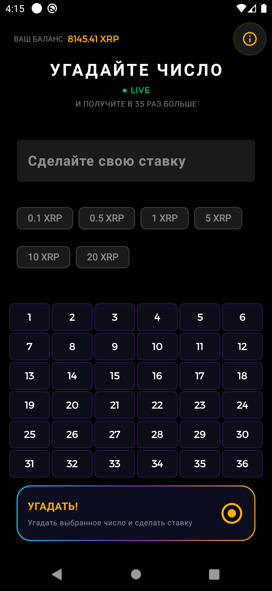
  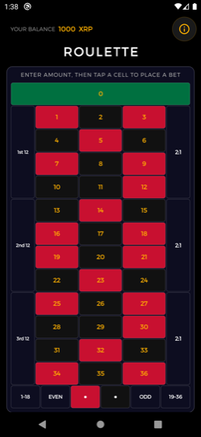
  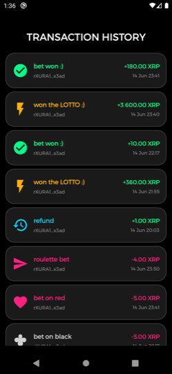
</p>

<p align="center">
  <em>Game selection (4 games) · Guess the Color · Guess the Number · Roulette · Transaction history</em>
</p>

<p align="center">
  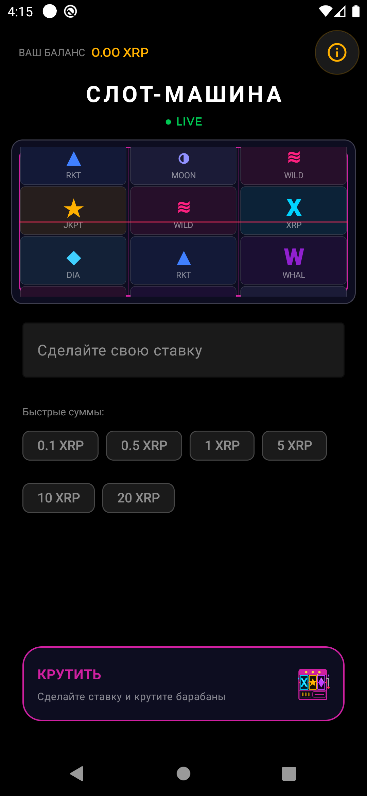
  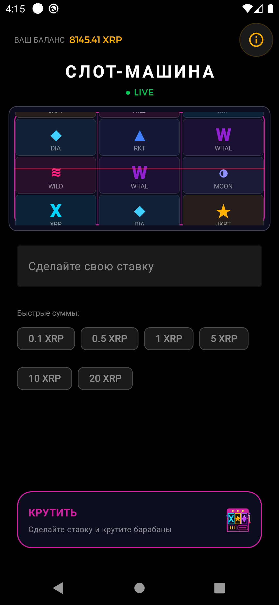
  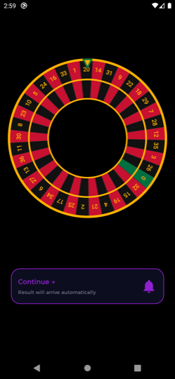
  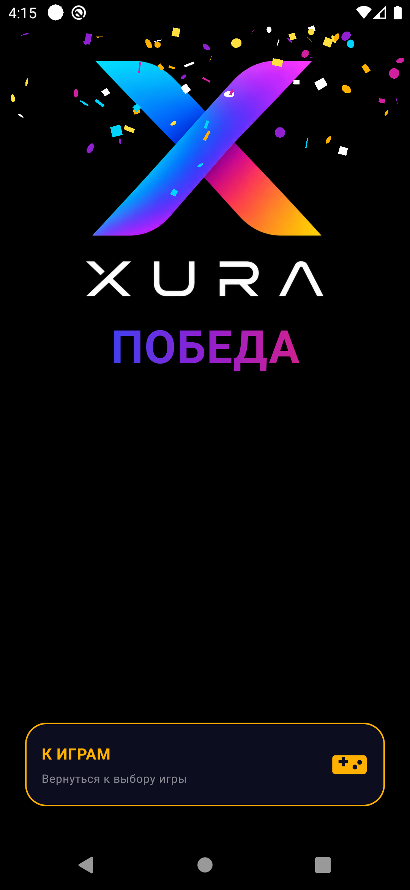
  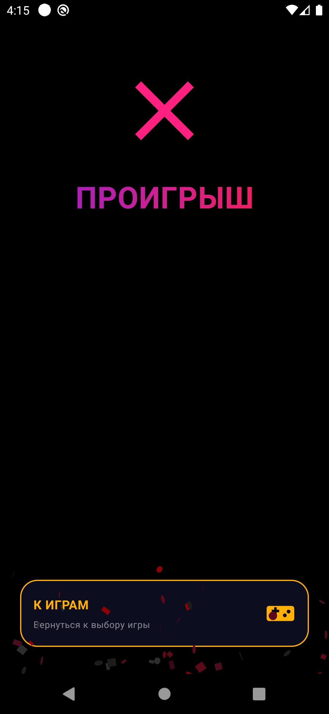
</p>

<p align="center">
  <em>Slot Machine (symbols + chips) · Slot reels · Roulette wheel · WIN screen (confetti) · LOST screen (ash)</em>
</p>

<p align="center">
  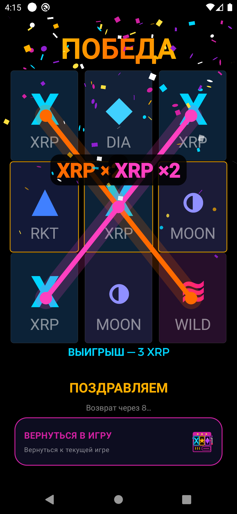
  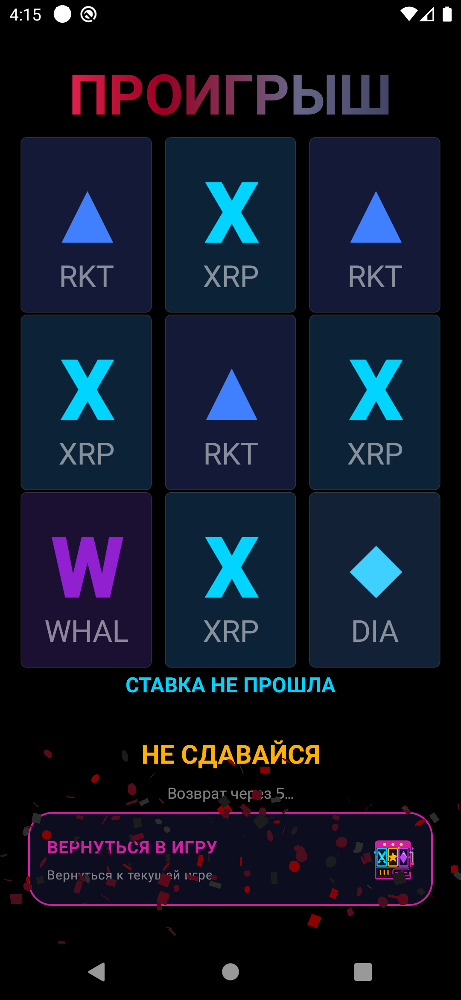
  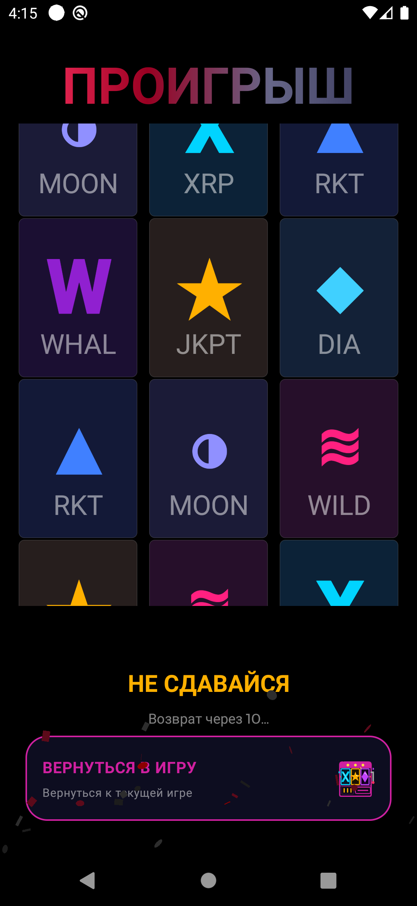
  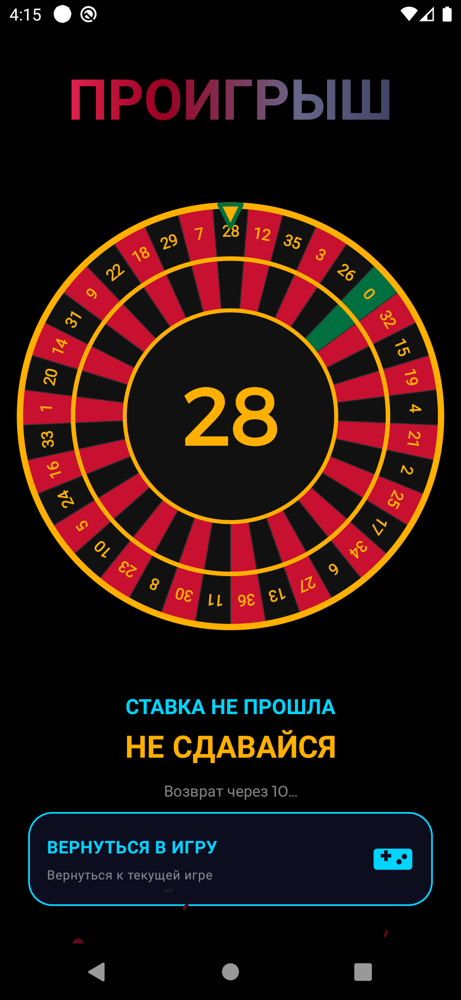
</p>

<p align="center">
  <em>Slot WIN (paylines highlighted + confetti) · Slot LOST (ash) · Slot Result activity · Roulette LOST (ash)</em>
</p>

<p align="center">
  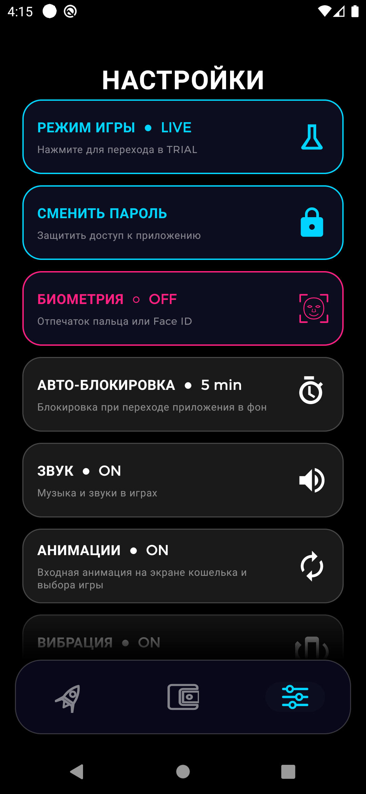
  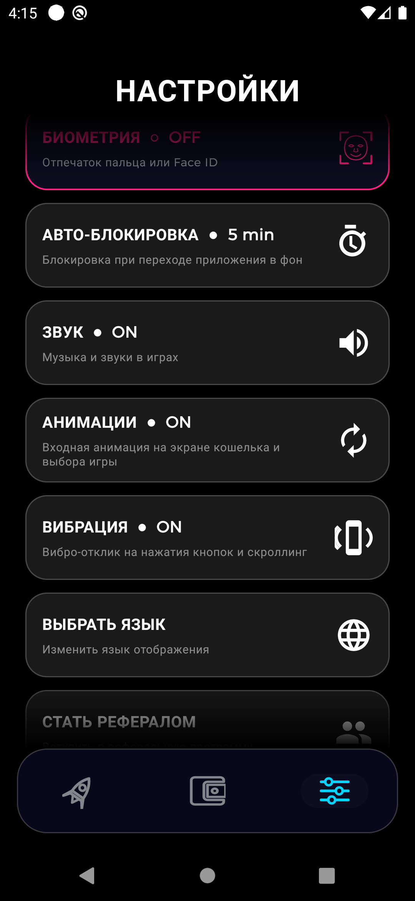
  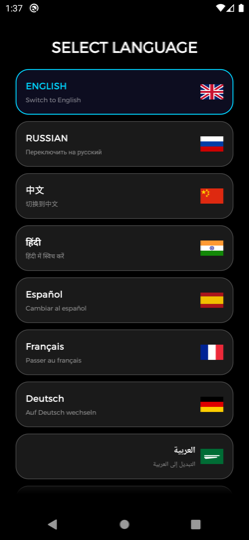
  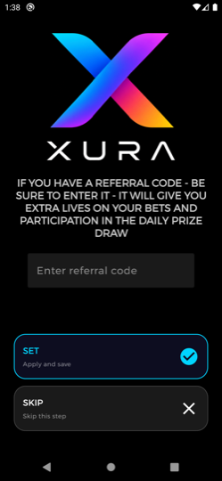
  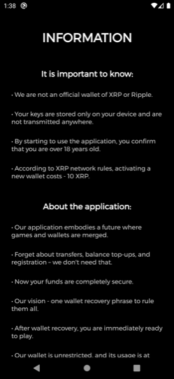
</p>

<p align="center">
  <em>Settings (top) · Settings: Sound / Animations / Vibration · 10 languages · Referral · Root detection</em>
</p>

---

## What is XURA?

XURA is a **non-custodial mobile wallet** for the XRP Ledger blockchain combined with a **blockchain-verifiable gaming platform** where every bet is a real on-chain XRP transaction. The game outcome is determined by the server and returned as a signed XRPL payment — verifiable on-chain, no trusted third party for the money flow.

The wallet side works fully **right now** on XRPL Mainnet. The game side requires the backend server (ETA: a few weeks).

---

## Vision: The Future of On-Chain Gaming

**XURA is a proof-of-concept, not just a product.**

This implementation demonstrates how on-chain gaming *should* work — transparent, non-custodial, and verifiable by anyone. The XRP Ledger is the first chain we built on, but **the architecture is blockchain-agnostic**:

> The same pattern — *non-custodial wallet + on-chain bets as real transactions + server-signed payouts verifiable on-chain* — applies equally to **Ethereum, Solana, Stellar, TON, Tron**, or any account-based or UTXO chain that supports memos/data fields on transactions.

We believe this is how gambling should look in the future:
- No casino account, no deposit, no withdrawal request
- Every bet is a native blockchain transaction
- The server cannot cheat — every outcome is signed and verifiable
- Users keep custody of funds at all times

**XURA on XRPL is the reference implementation. The model scales to any chain.**

---

## Why XURA?

Unlike traditional crypto casinos, XURA never holds your funds:

| Feature | Traditional Casino | XURA |
|---------|-------------------|------|
| Fund custody | Platform | User (non-custodial) |
| Deposits | Internal balance | Direct XRPL transaction |
| Withdrawals | Request required | Not required — funds stay on-chain |
| Result transparency | Limited | Every bet verifiable on-chain |
| Private key | Not applicable | Never leaves your device |

Every winning payout is sent directly back to your wallet address — no withdrawal requests, no hidden balances, no trust required.

---

## Features

### Wallet
| Feature | Details |
|---------|---------|
| Create wallet | Generates a new XRPL keypair; seed displayed once and secured immediately |
| Restore wallet | Import any XRPL account via 16-word seed phrase |
| Send XRP | Address input by hand or QR scan; destination tag support; confirmation dialog |
| Receive XRP | Your address as QR code + one-tap copy |
| Transaction history | Real-time list of incoming/outgoing payments via WebSocket subscription; colored icons per type |
| Balance | Live balance updated over persistent WebSocket connection to `wss://xrplcluster.com`; displayed to 2 decimal places |
| Testnet mode | Switch to XRPL Altnet for development without real funds |

### Security
| Feature | Details |
|---------|---------|
| Android Keystore AES-256-GCM | Seed phrase encrypted inside the TEE — never exposed in plaintext |
| Double seed encryption (PIN layer) | Optional second encryption layer: seed is re-encrypted with a PBKDF2-derived key from a user PIN, stored separately from the Keystore key |
| Biometric unlock | Fingerprint / Face ID via `androidx.biometric` (BIOMETRIC_STRONG only) |
| App password (PBKDF2) | PBKDF2WithHmacSHA256, 310 000 iterations, 256-bit output, 16-byte SecureRandom salt stored in EncryptedSharedPreferences |
| Legacy password migration | On first login with old SHA-256 hash, automatically re-hashes with PBKDF2 transparently |
| Inactivity auto-lock | Screen locks after a configurable idle period (30 s / 1 / 3 / 5 / 15 min) |
| Root detection | Warns if the device appears to be rooted |
| Anti-debug detection | Detects debugger attachment in production builds |
| FLAG_SECURE | Prevents screenshots on sensitive screens (seed display, password entry) |
| Clipboard safety | Confirmation dialog before sending to guard against clipboard address-swap attacks |

### Games *(backend required — not yet live)*
| Game | Mechanic | Payout |
|------|----------|--------|
| Guess the Color | Pick Red or Black | **×2** |
| Guess the Number | Pick 1–36 | **×36** |
| European Roulette | Full table (straight, red/black, odd/even, dozens, columns) | **×2 – ×36** |
| Slot Machine | 3-reel, 7 symbols including Wild; win on middle payline | **×2 – ×100** |

All bets are sent as real XRPL transactions with a structured memo (`BET:R:…`). The server responds with a signed payment and a memo (`WIN:N` or `LOSE:N`) that the client verifies on-chain.

#### Slot Machine details

**Symbols & payouts** (×bet per matching payline):

| Symbol | Label | Multiplier |
|--------|-------|-----------|
| X (Ripple) | XRP | ×2 |
| Rocket | RKT | ×5 |
| Moon | MOON | ×10 |
| Diamond | DIA | ×20 |
| Whale | WHAL | ×50 |
| Jackpot Star | JKPT | ×100 |
| Wave | WILD | substitutes for any symbol |

**Paylines** — 5 lines checked after each spin:

| # | Line | Color |
|---|------|-------|
| 1 | Middle horizontal | Gold |
| 2 | Top horizontal | Cyan |
| 3 | Bottom horizontal | Green |
| 4 | Diagonal ↘ | Orange |
| 5 | Diagonal ↗ | Magenta |

Multiple paylines can win simultaneously; each pays independently.

**Visual effects:**
- **WIN** — gold confetti falls from the top, winning paylines animate with glowing colored traces, each line labeled with symbol and multiplier
- **LOST** — dark red/charcoal ash particles rise from the bottom

**Implementation:**
- Custom `SlotReelView` renders 3 independently animated reels via canvas drawing
- `SlotReelStrip` — 84-symbol strip with configurable reel order and Wild placement
- `SlotPaylineView` — animated win-line overlay: traces each winning line with glow + label
- `SlotResult` screen: brief re-spin on last known positions → reveal → confetti/ash
- Stop-positions preserved across screen transitions via `static volatile` fields

#### Bet input (all games)
- Three input styles selectable in Settings: **Chips** (quick-tap amounts) · **Slider** · **+/− stepper**
- `BetInputFilter` — `InputFilter` applied at character level: blocks values > 100 XRP, prevents more than 1 decimal place, rejects leading zeros and double dots before text reaches the field
- Uniform limits across all games: **min 0.1 XRP · max 100 XRP**

### Audio
| Sound | When | Player |
|-------|------|--------|
| `in_casino.mp3` | Background music during gameplay | MediaPlayer (looping, 50% volume) |
| `roulette_spin.mp3` | Slot machine / Roulette spinning animation | MediaPlayer (looping, full volume) |
| `win.mp3` | Bet won result screen | MediaPlayer (once) |
| `lost.mp3` | Bet lost result screen | MediaPlayer (once) |
| `bet.mp3` | Bet confirmation sent | SoundPool (zero-latency) |
| `error.mp3` | Validation error | SoundPool (zero-latency) |
| UI button sounds | Every button tap (nav / select / action) | `UiSoundPlayer` — PCM-synthesized, `AudioTrack MODE_STATIC` |

All audio respects **AudioFocus** (pause on phone call, duck on transient loss) and the global **Sound ON/OFF** toggle in Settings.

`UiSoundPlayer` generates three micro-sounds entirely in code (no audio files):
- **nav** — 8 ms, 900 Hz soft tap (back, rules, navigation)
- **select** — 18 ms, 650 + 1300 Hz metallic tink (chips, bet buttons, grid cells)
- **action** — 28 ms, 340 + 170 Hz heavy thud (reserved for primary actions)

### Haptic Feedback
- All game buttons and navigation produce tactile feedback via `HapticFeedbackConstants.KEYBOARD_TAP`
- Scroll in Transaction History produces per-row tick via `HapticFeedbackConstants.CLOCK_TICK`
- No `VIBRATE` permission required (`FLAG_IGNORE_GLOBAL_SETTING`)
- **Vibration toggle** in Settings (ON by default) — persisted in SharedPreferences

### Settings
| Setting | Description |
|---------|-------------|
| Sound | Global audio on/off |
| Vibration | Haptic feedback on buttons and scroll on/off |
| Animations | Entry/exit animations on/off |
| Bet input style | Chips / Slider / +/− stepper |
| Bet timeout | Auto-cancel bet if no server response (3 / 5 / 10 / 30 / 60 s) |
| Auto-lock timeout | Inactivity lock delay |
| Biometric | Enable/disable fingerprint unlock |
| Language | 10 languages |
| Game mode | LIVE (real XRP) / TRIAL (test balance) |

### Referral System
- Become a referral partner by recording a **66 XRP on-chain registration fee** — partially recoverable (13 XRP refunded on exit). The fee is a blockchain record, not a payment to the app.
- Enter a referral code to earn bonus lives and participate in daily prize draws
- Full referral management UI (become / restore / view your referrals)

### Internationalisation
10 languages out of the box: **English, Russian, Chinese (中文), Hindi, Spanish, French, German, Arabic, Portuguese, Bengali**

All strings — including new Settings cards (Vibration, Animations) — are fully localised in all 10 languages.

---

## Architecture

```
Java · MVVM · Dagger Hilt DI

com.samuilolegovich
├── view/           — Activities (UI layer)
│   ├── SlotGame        — Slot machine bet screen
│   ├── SlotFlasher     — Animated reels while waiting for server
│   ├── SlotResult      — Result reveal when server replied after leaving Flasher
│   ├── SlotReelView    — Custom View: canvas-drawn animated reel
│   ├── SlotPaylineView — Custom View: win-line overlay animation
│   ├── SlotReelStrip   — 84-symbol strip & matrix builder
│   └── ...             — Wallet, Roulette, Color, Number, Settings, History, …
├── viewmodel/      — ViewModels + LiveData state
├── wallet/
│   ├── client/     — XRPL RPC + WebSocket clients (xrpl4j, OkHttp)
│   └── model/      — PaymentManager, SocketManager
├── async/runnable/ — Background Runnables (balance, subscriber, notifier)
├── config/         — NetworkConfig (mainnet/testnet runtime switching)
├── enums/          — StringEnum: all constants in one place
├── utils/
│   ├── SecureSeedStorage   — AES-256-GCM seed encryption via Android Keystore
│   ├── Cipher              — PBKDF2WithHmacSHA256 password hashing
│   ├── LegacyCipher        — SHA-256 legacy hash verifier (migration path only)
│   ├── BiometricHelper     — Fingerprint / Face ID prompt wrapper
│   ├── AudioHelper         — AudioFocus management + isSoundEnabled()
│   ├── UiSoundPlayer       — PCM-synthesized button sounds (AudioTrack)
│   ├── BetInputFilter      — InputFilter: enforces 0.1–100 XRP range at char level
│   ├── GameSoundPool       — SoundPool wrapper for bet/error sounds
│   ├── InactivityGuard     — Auto-lock on idle
│   ├── RootDetector        — Root / tamper detection
│   └── AntiDebugDetector   — Debugger detection (release builds)
└── di/             — Hilt AppModule
```

**Key libraries:**
- `org.xrpl:xrpl4j-core / xrpl4j-client 3.3.0` — XRPL account & transaction handling
- `org.java-websocket:Java-WebSocket 1.5.7` — persistent WebSocket to XRPL cluster
- `com.google.dagger:hilt-android 2.51.1` — dependency injection
- `androidx.biometric 1.2.0-alpha05` — biometric authentication
- `androidx.security:security-crypto 1.1.0-alpha06` — EncryptedSharedPreferences layer
- `com.google.mlkit:barcode-scanning 17.0.2` + CameraX — QR code scanner
- `com.squareup.retrofit2:retrofit 2.11.0` — REST calls to Ripple RPC nodes
- `com.google.zxing:core 3.3.2` — QR code generation
- `nl.dionsegijn:konfetti-xml` — confetti / ash particle effects on win/loss screens

---

## How to Build

### Prerequisites
| Tool | Version |
|------|---------|
| Android Studio | Hedgehog or newer |
| JDK | 17 |
| Android SDK | compileSdk 36, buildToolsVersion 36.1.0 |
| Gradle | 8.x (wrapper included) |

### Steps

```bash
# 1. Clone the repository
git clone https://github.com/SamuilOlegovich/xura-android.git
cd xura-android

# 2. Open in Android Studio  OR  build from the command line:

# Debug build
./gradlew assembleDebug

# Release build (requires a signing keystore — see below)
./gradlew assembleRelease
```

### Release signing

Create `keystore.jks` and configure `app/build.gradle` signing block, or use the `RELEASE_SIGNATURE_CHECKLIST.md` file included in the repo for the full checklist before publishing.

### Run tests

```bash
# Unit tests
./gradlew test

# Instrumented tests (requires a connected device / emulator)
./gradlew connectedAndroidTest
```

79 automated tests included.

---

## Supported Devices

- **Android 9.0 Pie (API 28)** and higher
- Biometric hardware optional (fallback to password is available)
- Camera optional (QR scan — manual address entry always available)

---

## Network

| Network | RPC | WebSocket |
|---------|-----|-----------|
| Mainnet | `https://s1.ripple.com:51234` | `wss://xrplcluster.com` |
| Testnet | `https://s.altnet.rippletest.net:51234` | `wss://s.altnet.rippletest.net:51233` |

Switch between networks in **Settings → DEV panel** (debug builds only). Game server addresses are stored per-network and can be overridden for self-hosted backends.

---

## Roulette Protocol (for backend implementors)

The full server specification (memo format, bet codes, payout table, WebSocket subscription, idempotency requirements) is documented in [`ROULETTE_BACKEND_SPEC.md`](ROULETTE_BACKEND_SPEC.md).

Quick summary:
```
Client → Server  (bet):
  XRPL Payment to rGrEJZaBFYhPGuyM7NiJbJw2yXVB9vJHah
  MemoData: HEX("BET:R:{code}@{amount},...:{referral}")

Server → Client  (result):
  XRPL Payment back to player address
  MemoData: HEX("WIN:{number}") or HEX("LOSE:{number}")
```

---

## Disclaimer

XURA does not provide financial or investment advice. Cryptocurrency values are volatile and all transactions on the XRP Ledger are irreversible.

Users are solely responsible for complying with local laws and regulations regarding cryptocurrency ownership and online gaming. Availability of gaming features may be restricted or prohibited in certain jurisdictions.

**Use at your own risk.**

---

## License & Usage

**The wallet functionality is free to use for non-commercial purposes.**

You are welcome to use this application as a personal XRP crypto wallet at no charge, with no restrictions, as long as use is **non-commercial**.

**The game server (backend) is proprietary and not included in this repository.**  
The gaming logic in this app is intentionally inoperative without the server — do not attempt to play with real XRP until the official launch announcement.

**For any commercial use, integration, licensing, or partnership proposals — please contact the author directly to negotiate terms.**

> **License (short):**  
> Use as a non-commercial crypto wallet — permitted.  
> Game logic does not work without the server — do not play with real XRP.  
> For any commercial proposals or use — contact the author, we will negotiate.

---

## Contact

- **GitHub:** [SamuilOlegovich](https://github.com/SamuilOlegovich)
- **Email:** samuilolegovich@gmail.com

---

## Roadmap

- [x] Non-custodial XRP wallet (mainnet ready)
- [x] Biometric + PBKDF2 password security
- [x] Double seed encryption via optional PIN layer
- [x] Legacy password migration (SHA-256 → PBKDF2 on first login)
- [x] QR send/receive
- [x] Transaction history with colored icons
- [x] European Roulette UI + protocol
- [x] Guess the Color / Guess the Number UI + protocol
- [x] **Slot Machine** — 3-reel, Wild symbol, payline animation, result screen
- [x] Referral system on-chain
- [x] 10-language localisation (all new UI strings fully translated)
- [x] Full audio system — background music, win/lost sounds, AudioFocus, PCM button sounds
- [x] Haptic feedback — all buttons + scroll, toggle in Settings
- [x] Bet input validation — `BetInputFilter`, uniform 0.1–100 XRP across all games
- [x] Settings: Sound / Vibration / Animations / Bet style / Timeout / Language / Biometric
- [x] Unified header across all screens; balance shown to 2 decimal places
- [ ] **Game server launch** — ETA: coming weeks
- [ ] Push notifications for incoming payments
- [ ] Google Play release

---

*Built with ❤️ on the XRP Ledger.*
