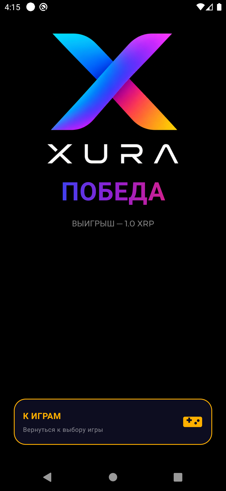
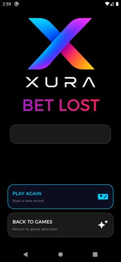

# XURA — XRP Wallet & Gaming Platform

> **Non-custodial XRP Ledger wallet with built-in blockchain-powered games.**  
> Android application written in Java · minSdk 28 (Android 9+) · version 26.6.17  
> *Originally started in 2022 as an XRP wallet experiment — rewritten and actively maintained through 2026.*

---

## ⚠️ Important Notice / Важное предупреждение

**GAME SERVER IS NOT YET LIVE.**  
The gaming logic (Roulette, Guess the Color, Guess the Number) requires a dedicated backend server that is currently under development. **Do NOT play with real XRP until the server goes live.** The author will announce availability separately.

> **Игровой сервер ещё не запущен.**  
> Игровая логика (рулетка, «Угадай цвет», «Угадай число») требует бэкенд-сервера, который сейчас в разработке. **Не играйте на реальный XRP до официального объявления запуска.**

---

## Screenshots

<p align="center">
  
  
  
  
  
</p>

<p align="center">
  <em>Splash · Onboarding: Welcome · Send &amp; Receive · Play &amp; Win · Secure by Design</em>
</p>

<p align="center">
  
  
  
  
  
</p>

<p align="center">
  <em>Create or restore · New wallet seed · Seed verification · Main wallet (1000 XRP) · Send XRP</em>
</p>

<p align="center">
  
  
  
  
  
</p>

<p align="center">
  <em>Game selection · Guess the Color · Guess the Number · Roulette · Transaction history</em>
</p>

<p align="center">
  
  
  
</p>

<p align="center">
  <em>Roulette wheel (waiting for result) · BET WON · BET LOST</em>
</p>

<p align="center">
  
  
  
  
  
</p>

<p align="center">
  <em>Settings · 10 languages · Referral system · Root/tamper detection</em>
</p>

---

## What is XURA?

XURA is a **non-custodial mobile wallet** for the XRP Ledger blockchain combined with a **Blockchain-verifiable gaming platform** where every bet is a real on-chain XRP transaction. The game outcome is determined by the server and returned as a signed XRPL payment — verifiable on-chain, no trusted third party for the money flow.

The wallet side works fully **right now** on XRPL Mainnet. The game side requires the backend server (ETA: a few weeks).

---

## Vision: The Future of On-Chain Gaming

**XURA is a proof-of-concept, not just a product.**

This implementation demonstrates how on-chain gaming *should* work — transparent, non-custodial, and verifiable by anyone. The XRP Ledger is the first chain we built on, but **the architecture is blockchain-agnostic**:

> The same pattern — *non-custodial wallet + on-chain bets as real transactions + server-signed payouts verifiable on-chain* — applies equally to **Ethereum, Solana, Stellar, TON, Tron**, or any account-based or UTXO chain that supports memos/data fields on transactions.

We believe this is how gambling should look in the future:
- No casino account, no deposit, no withdrawal request
- Every bet is a native blockchain transaction
- The server cannot cheat — every outcome is signed and verifiable
- Users keep custody of funds at all times

**XURA on XRPL is the reference implementation. The model scales to any chain.**

---

## Why XURA?

Unlike traditional crypto casinos, XURA never holds your funds:

| Feature | Traditional Casino | XURA |
|---------|-------------------|------|
| Fund custody | Platform | User (non-custodial) |
| Deposits | Internal balance | Direct XRPL transaction |
| Withdrawals | Request required | Not required — funds stay on-chain |
| Result transparency | Limited | Every bet verifiable on-chain |
| Private key | Not applicable | Never leaves your device |

Every winning payout is sent directly back to your wallet address — no withdrawal requests, no hidden balances, no trust required.

---

## Features

### Wallet
| Feature | Details |
|---------|---------|
| Create wallet | Generates a new XRPL keypair; seed displayed once and secured immediately |
| Restore wallet | Import any XRPL account via 16-word seed phrase |
| Send XRP | Address input by hand or QR scan; destination tag support; confirmation dialog |
| Receive XRP | Your address as QR code + one-tap copy |
| Transaction history | Real-time list of incoming/outgoing payments via WebSocket subscription |
| Balance | Live balance updated over persistent WebSocket connection to `wss://xrplcluster.com` |
| Testnet mode | Switch to XRPL Altnet for development without real funds |

### Security
| Feature | Details |
|---------|---------|
| Android Keystore AES-256-GCM | Seed phrase is encrypted inside the TEE (Trusted Execution Environment) — never exposed in plaintext |
| Biometric unlock | Fingerprint / Face ID via `androidx.biometric` (BIOMETRIC_STRONG only) |
| App password (PBKDF2) | Optional PIN/password as a fallback or primary lock |
| Inactivity auto-lock | Screen locks after a configurable idle period |
| Root detection | Warns if the device appears to be rooted |
| Anti-debug detection | Detects debugger attachment in production builds |
| FLAG_SECURE | Prevents screenshots on sensitive screens (seed display, password entry) |
| Clipboard safety | Confirmation dialog before sending to guard against clipboard address-swap attacks |

### Games *(backend required — not yet live)*
| Game | Mechanic | Payout |
|------|----------|--------|
| Guess the Color | Pick Red or Black | **×2** |
| Guess the Number | Pick 1–36 | **×36** |
| European Roulette | Full table (straight, red/black, odd/even, dozens, columns) | **×2 – ×36** |

All bets are sent as real XRPL transactions with a structured memo (`BET:R:…`). The server responds with a signed payment and a memo (`WIN:N` or `LOSE:N`) that the client verifies on-chain.

### Referral System
- Become a referral partner by recording a **66 XRP on-chain registration fee** — partially recoverable (13 XRP refunded on exit). The fee is a blockchain record, not a payment to the app.
- Enter a referral code to earn bonus lives and participate in daily prize draws
- Full referral management UI (become / restore / view your referrals)

### Internationalisation
10 languages out of the box: **English, Russian, Chinese (中文), Hindi, Spanish, French, German, Arabic, Portuguese, Bengali**

---

## Architecture

```
Java · MVVM · Dagger Hilt DI

com.samuilolegovich
├── view/           — Activities (UI layer)
├── viewmodel/      — ViewModels + LiveData state
├── wallet/
│   ├── client/     — XRPL RPC + WebSocket clients (xrpl4j, OkHttp)
│   └── model/      — PaymentManager, SocketManager
├── async/runnable/ — Background Runnables (balance, subscriber, notifier)
├── config/         — NetworkConfig (mainnet/testnet runtime switching)
├── enums/          — StringEnum: all constants in one place
├── utils/          — SecureSeedStorage, BiometricHelper, Cipher, RootDetector, …
└── di/             — Hilt AppModule
```

**Key libraries:**
- `org.xrpl:xrpl4j-core / xrpl4j-client 3.3.0` — XRPL account & transaction handling
- `org.java-websocket:Java-WebSocket 1.5.7` — persistent WebSocket to XRPL cluster
- `com.google.dagger:hilt-android 2.51.1` — dependency injection
- `androidx.biometric 1.2.0-alpha05` — biometric authentication
- `androidx.security:security-crypto 1.1.0-alpha06` — EncryptedSharedPreferences layer
- `com.google.mlkit:barcode-scanning 17.0.2` + CameraX — QR code scanner
- `com.squareup.retrofit2:retrofit 2.11.0` — REST calls to Ripple RPC nodes
- `com.google.zxing:core 3.3.2` — QR code generation

---

## How to Build

### Prerequisites
| Tool | Version |
|------|---------|
| Android Studio | Hedgehog or newer |
| JDK | 17 |
| Android SDK | compileSdk 36, buildToolsVersion 36.1.0 |
| Gradle | 8.x (wrapper included) |

### Steps

```bash
# 1. Clone the repository
git clone https://github.com/SamuilOlegovich/xura-android.git
cd xura-android

# 2. Open in Android Studio  OR  build from the command line:

# Debug build
./gradlew assembleDebug

# Release build (requires a signing keystore — see below)
./gradlew assembleRelease
```

### Release signing

Create `keystore.jks` and configure `app/build.gradle` signing block, or use the `RELEASE_SIGNATURE_CHECKLIST.md` file included in the repo for the full checklist before publishing.

### Run tests

```bash
# Unit tests
./gradlew test

# Instrumented tests (requires a connected device / emulator)
./gradlew connectedAndroidTest
```

79 automated tests included.

---

## Supported Devices

- **Android 9.0 Pie (API 28)** and higher
- Biometric hardware optional (fallback to password is available)
- Camera optional (QR scan — manual address entry always available)

---

## Network

| Network | RPC | WebSocket |
|---------|-----|-----------|
| Mainnet | `https://s1.ripple.com:51234` | `wss://xrplcluster.com` |
| Testnet | `https://s.altnet.rippletest.net:51234` | `wss://s.altnet.rippletest.net:51233` |

Switch between networks in **Settings → DEV panel** (debug builds only). Game server addresses are stored per-network and can be overridden for self-hosted backends.

---

## Roulette Protocol (for backend implementors)

The full server specification (memo format, bet codes, payout table, WebSocket subscription, idempotency requirements) is documented in [`ROULETTE_BACKEND_SPEC.md`](ROULETTE_BACKEND_SPEC.md).

Quick summary:
```
Client → Server  (bet):
  XRPL Payment to rGrEJZaBFYhPGuyM7NiJbJw2yXVB9vJHah
  MemoData: HEX("BET:R:{code}@{amount},...:{referral}")

Server → Client  (result):
  XRPL Payment back to player address
  MemoData: HEX("WIN:{number}") or HEX("LOSE:{number}")
```

---

## Disclaimer

XURA does not provide financial or investment advice. Cryptocurrency values are volatile and all transactions on the XRP Ledger are irreversible.

Users are solely responsible for complying with local laws and regulations regarding cryptocurrency ownership and online gaming. Availability of gaming features may be restricted or prohibited in certain jurisdictions.

**Use at your own risk.**

---

## License & Usage

**The wallet functionality is free to use for non-commercial purposes.**

You are welcome to use this application as a personal XRP crypto wallet at no charge, with no restrictions, as long as use is **non-commercial**.

**The game server (backend) is proprietary and not included in this repository.**  
The gaming logic in this app is intentionally inoperative without the server — do not attempt to play with real XRP until the official launch announcement.

**For any commercial use, integration, licensing, or partnership proposals — please contact the author directly to negotiate terms.**

> **Лицензия (кратко):**  
> Использование в качестве некоммерческого крипто-кошелька — разрешено.  
> Игровая логика без сервера не работает — не играйте на реальные деньги.  
> По любым коммерческим предложениям или использованию — обращайтесь, будем договариваться.

---

## Contact

- **GitHub:** [SamuilOlegovich](https://github.com/SamuilOlegovich)
- **Email:** samuilolegovich@gmail.com

---

## Roadmap

- [x] Non-custodial XRP wallet (mainnet ready)
- [x] Biometric + password security
- [x] QR send/receive
- [x] Transaction history
- [x] European Roulette UI + protocol
- [x] Guess the Color / Guess the Number UI + protocol
- [x] Referral system on-chain
- [x] 10-language localisation
- [ ] **Game server launch** — ETA: coming weeks
- [ ] Push notifications for incoming payments
- [ ] Google Play release

---

*Built with ❤️ on the XRP Ledger.*
